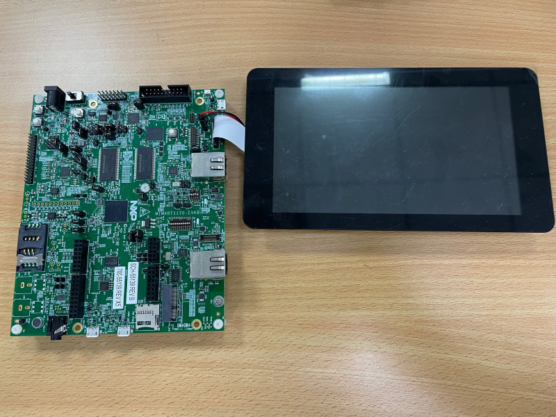
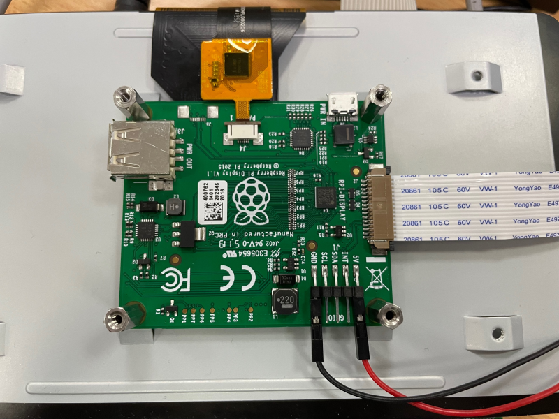
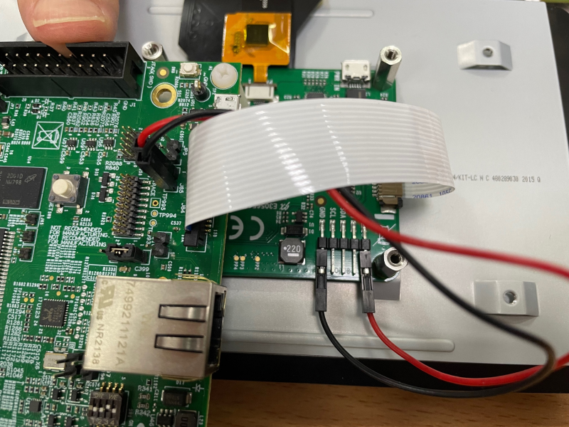
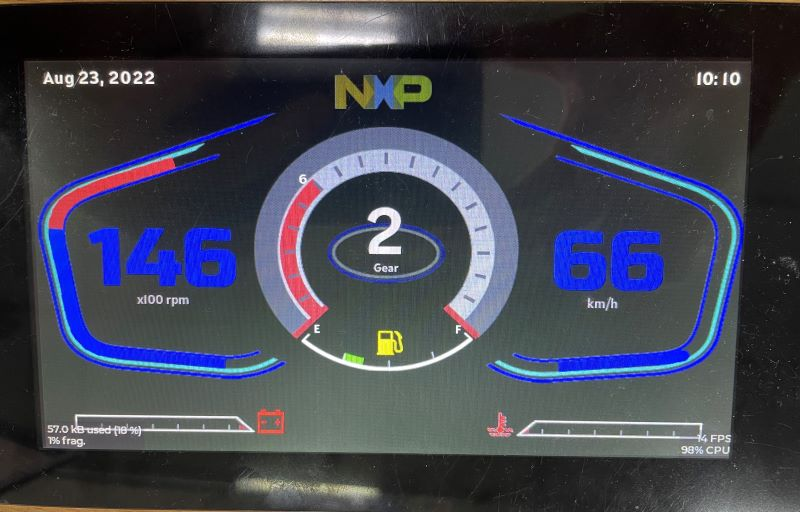
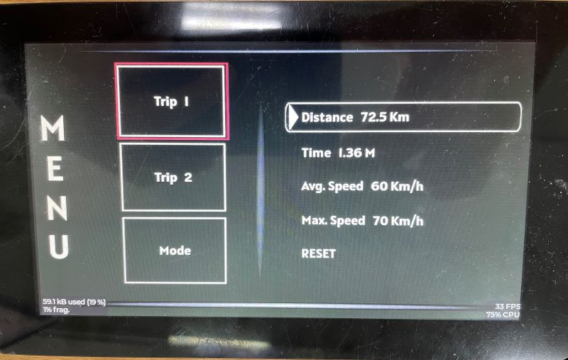
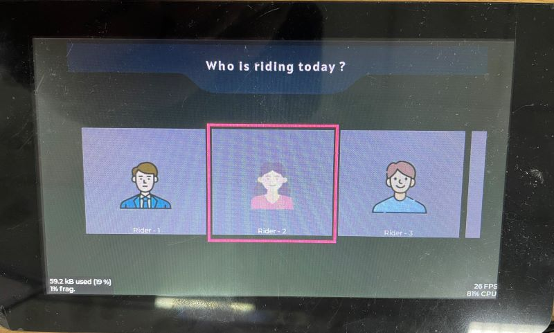

# NXP Application Code Hub

## lvgl_cluster_rt1170_evkb_rpi
This is a cluster demo with LVGL on Raspberry Pi 7" touch panel. This demo shows the interface of the car/e-bike when driving, including the interface of speedometer gear switching and user menu switching.

#### Boards: MIMXRT1170-EVKB
#### Categories: Graphics
#### Peripherals: DISPLAY
#### Toolchains: MCUXpresso IDE

## Table of Contents
1. [Software](#step1)
2. [Hardware](#step2)
3. [Setup](#step3)
4. [Results](#step4)
5. [FAQs](#step5) 
6. [Support](#step6)
7. [Release Notes](#step7)

## 1. Software
* This project based on SDK 2.13.0.
* LVGL version 8.3.2.

## 2. Hardware
1. i.MX RT1170-EVKB(This project works on REV B board).
2. [Raspberry Pi 7" touch display.](https://www.raspberrypi.com/products/raspberry-pi-touch-display/)
   
3. Power adapter.

## 3. Setup

1. Connect the Raspberry Pi 7" touch display to i.MX RT1170-EVKB board.
   Assemble the Raspberry Pi Display.
   

   Connect MIPI DSI cable to J84 on MIMXRT1170-EVKB.
   Connect J1 power of Raspberry Pi to J85 of MIMXRT1170-EVKB.
    
2. Import the project from MCUXpresso IDE.
3. Download the built project to the board and run the example.

## 4. Results
When the demo runs correctly, we will see the following interfaces.
       
    
    
## 5. FAQs

## 6. Support
#### Project Metadata
<!----- Boards ----->

<!----- Categories ----->

<!----- Peripherals ----->

<!----- Toolchains ----->

Questions regarding the content/correctness of this example can be entered as Issues within this GitHub repository.

>**Warning**: For more general technical questions regarding NXP Microcontrollers and the difference in expected funcionality, enter your questions on the [NXP Community Forum](https://community.nxp.com/)

## 7. Release Notes
| Version | Description / Update                           | Date                        |
|:-------:|------------------------------------------------|----------------------------:|
| 1.0     | Initial release on Application Code HUb        | 六月 27th 2023 |

